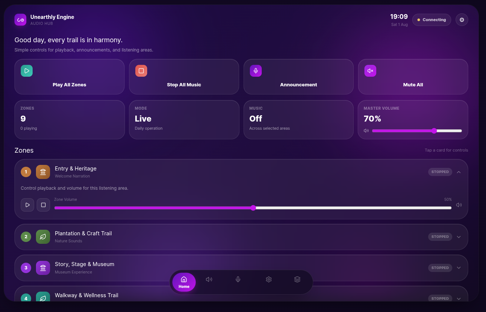

# AV-Zone-Controller-Portfolio

# AV Zone Controller

## Linux-Based Multi-Zone Audio Management Platform

## Overview

Designed and developed a Linux-based centralized audio control platform for commercial AV installations.

The system provides a web-based dashboard for controlling multiple audio zones from mobile devices over a local network.

The project demonstrates practical integration of:

- Linux system administration
- Network architecture
- Python automation
- Django REST API development
- React dashboard development
- Audio streaming concepts
- AV system design

## Project Goals

The objective was to replace expensive proprietary AV control systems with a flexible Linux-based platform.

Target applications:

- Event venues
- Resorts
- Museums
- Theme parks
- Public announcement systems
- Educational campuses

# System Architecture

Mobile Tablet
       |
       |
 Local Network
       |
       |
React Control Dashboard
       |
       |
Django REST API
       |
       |
Linux Audio Server
       |
       |
Audio Processing Layer
       |
       |
DSP / Amplifier / Speakers

# Technologies Used

## Backend

- Python
- Django REST Framework
- Linux subprocess automation

## Frontend

- React
- Vite
- Tailwind CSS
- Progressive Web App (PWA)

## Operating System

- Ubuntu Server

## Audio Technologies

- mpv
- FFmpeg concepts
- RTP/AES67 architecture study
- DSP integration planning

## Network Design

- TCP/IP networking
- Managed switches
- Fiber uplinks
- Local LAN control

# Features

✓ Multi-zone control

✓ Mobile-friendly dashboard

✓ Play / Stop control

✓ Volume management

✓ Local network operation

✓ Designed for hardware DSP integration

# Hardware Integration Roadmap

The software architecture is designed to support integration with:

- Professional DSP platforms
- Network audio systems
- AES67 compatible devices
- Dante-compatible workflows

# Skills Demonstrated

Linux Administration

Python Automation

REST API Development

Network Design

AV System Engineering

Embedded/Automation Concepts

Technical Documentation

# Project Status

Prototype completed.

Future development:

- Hardware DSP integration
- Real-time network audio streaming
- User authentication
- Device monitoring

- ## Dashboard Preview

## Architecture

# Author

Aswin N M

Linux System Administration | AV Automation | Network Engineering
